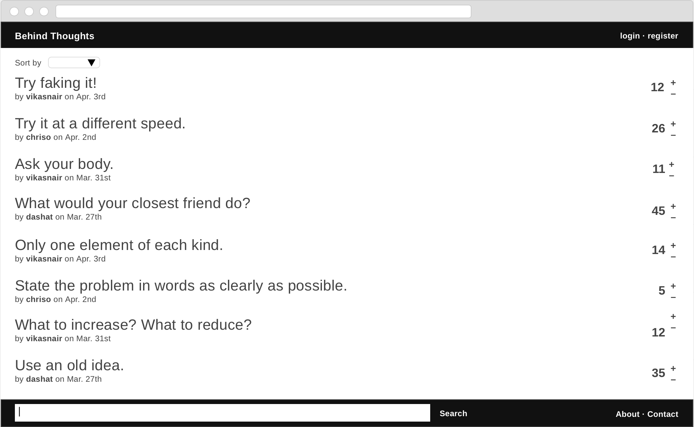
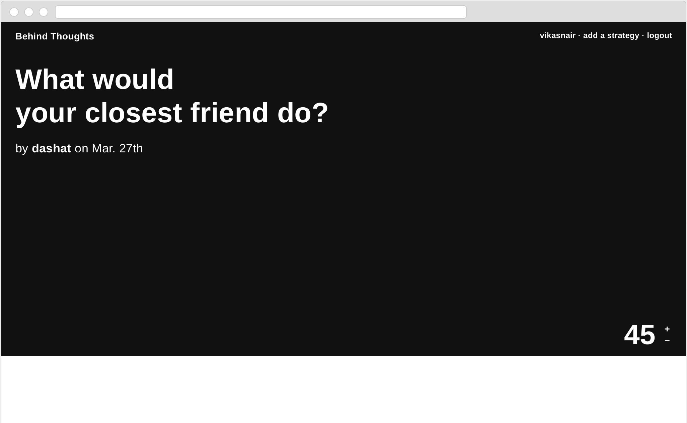
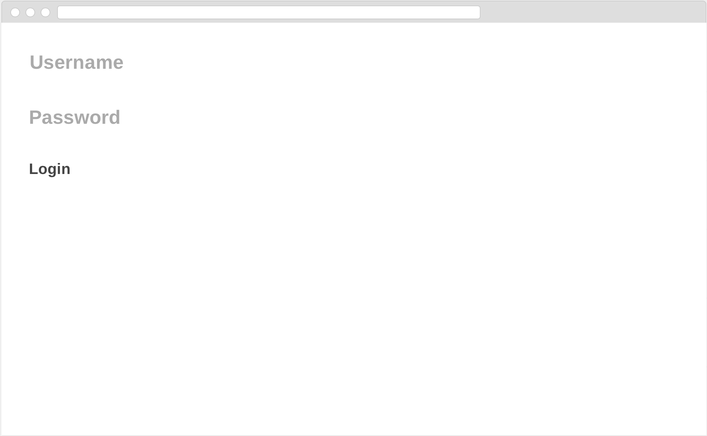
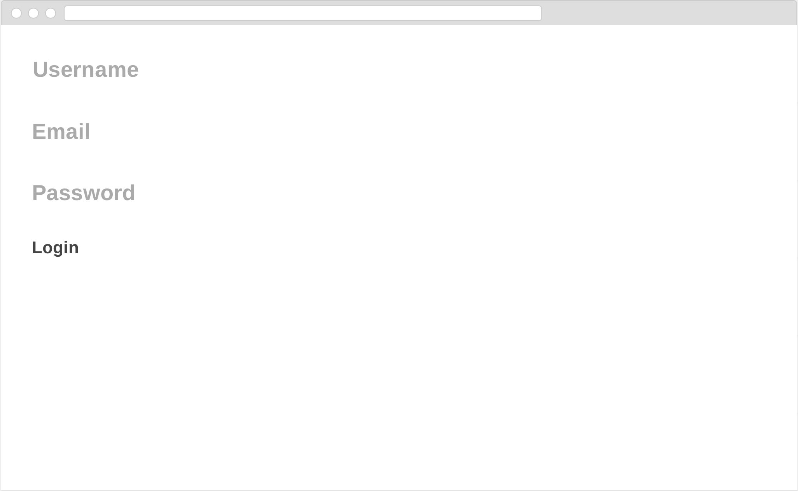

# Behind Thoughts

### Update: Live at http://behindthoughts.com

## Overview

**Behind Thoughts** is a platform for aggregating the thoughts behind thought required to beat creative blocks. Dedicated to the 'Oblique Strategies' card-deck by Brian Eno and Peter Schmidt.

On Behind Thoughts, all users can view randomized or sorted strategies. Registered users can additionally submit and vote on strategies.

## Data Model

The application will store users and strategies.

* users will have basic properties (name, auth details, etc.)
* strategies will have basic properties (title, votes, etc.) and a reference to the author (a user id)

User:

```javascript
{
  username: 'john_smith',
  email: 'john@smith.com',
  hash: // a password hash,
  id: // a unique identifier
}
```

Strategy:

```javascript
{
  title: 'Try faking it!',
  votes: 20,
  author: // a reference to a user,
  createdAt: 4-2-2018
}
```


## [Link to Commented First Draft Schema](src/db.js)

## Wireframes

index (/) - sortable list view of all strategies



strategy-detail (/strategy/:id) - page for showing large-view detail of one strategy



add-strategy (/add) - page for submitting a new strategy


login (/login) - page for logging in previous user



register (/register) - page for registering new user



## Site map

// Home: Index
Header links to self, add-strategy, login, register
Each strategy in list links to strategy-detail.

## User Stories or Use Cases

1. as non-registered user, I can view randomized or sorted strategies
2. as non-registered user, I can register a new account with the site
3. as a user, I can log in to the site
4. as a user, I can submit a unique strategy
5. as a user, I can vote on posted strategies

## Research Topics

* Integrate user authentication
  * using Passport
* Automated functional testing
  * using Selenium
  * tested four routes in typical ux flow
  * screencap: https://cl.ly/rDni
* Work with timestamps using external library
  * using moment.js
* Validate email using external library
  * using email-existence

## [Link to Initial Main Project File](src/app.js)

## Annotations / References Used

1. [oblique strategies](https://en.wikipedia.org/wiki/Oblique_Strategies)
2. [passport.js authentication docs](http://passportjs.org/docs)
